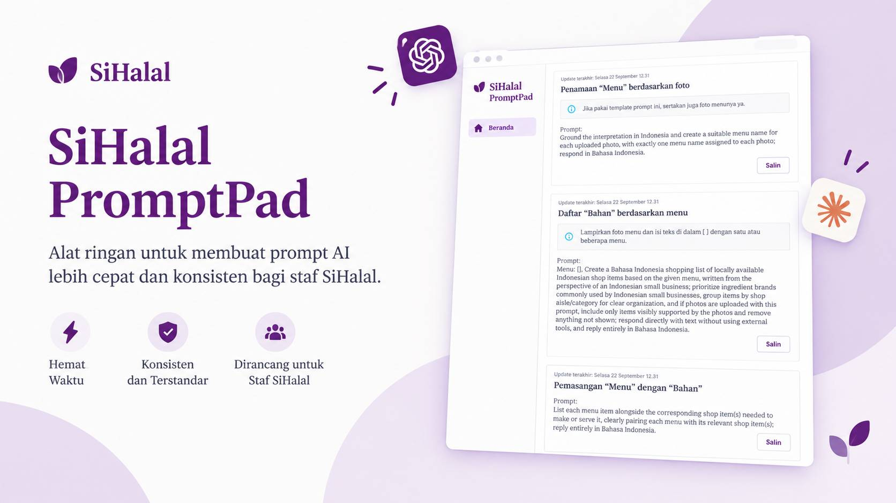

# sihalal-promptpad



A small static web app that helps SiHalal staff quickly build prompts to use with AI chat tools (like ChatGPT or Claude), without having to write everything from scratch.

## Run locally

From the project directory, start a local web server:

```bash
python3 -m http.server 8000
```

Then open http://localhost:8000 in your browser.
